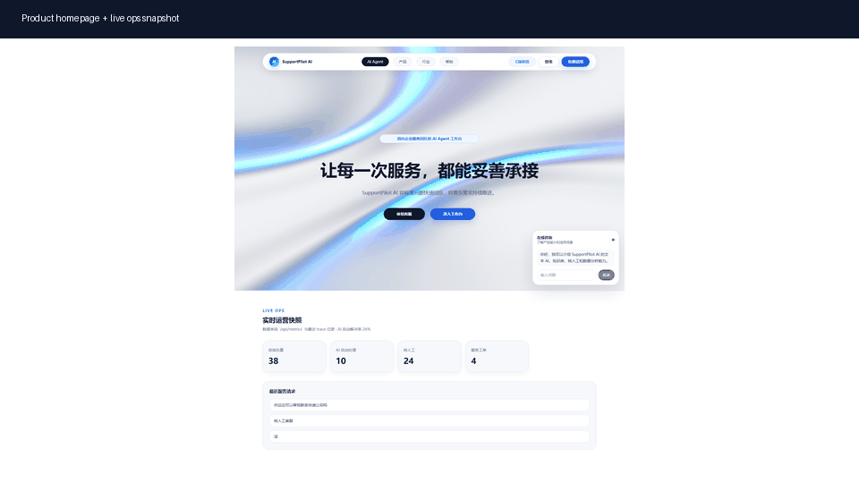
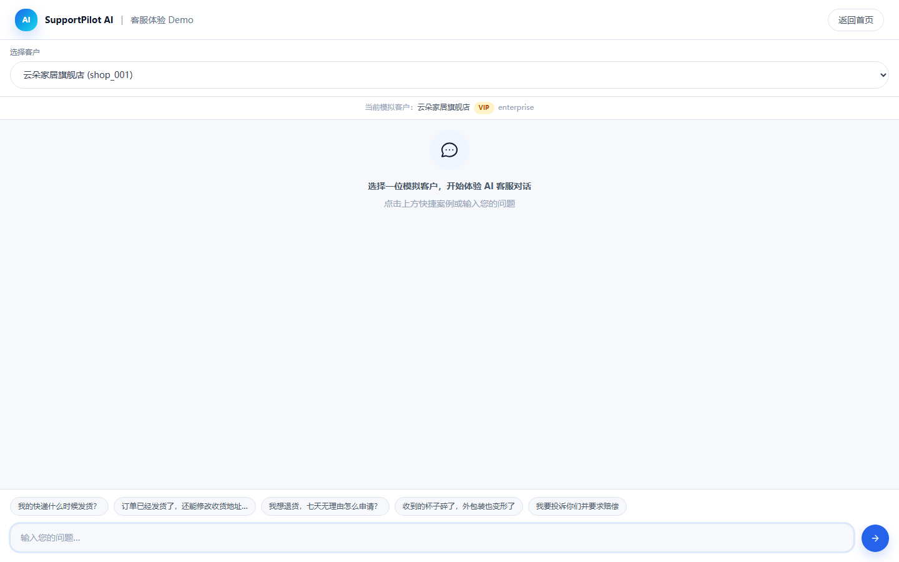
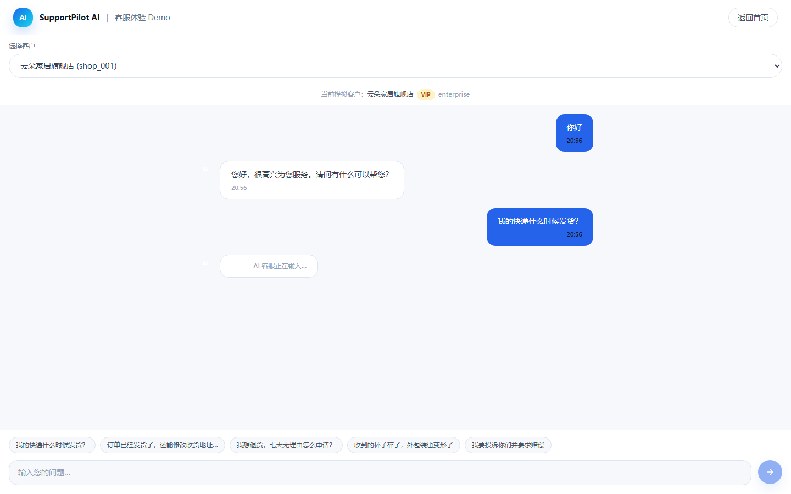
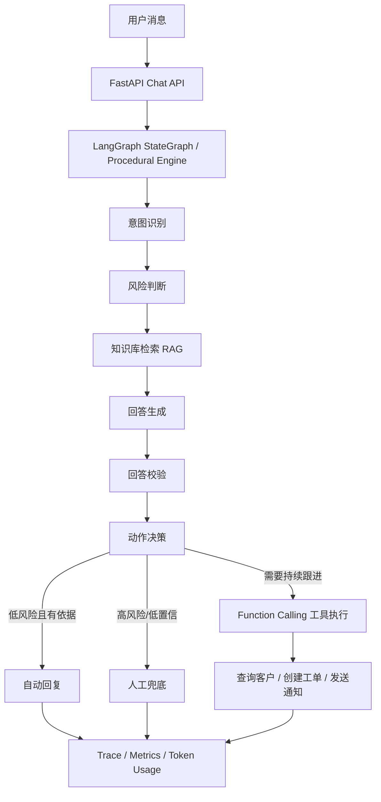
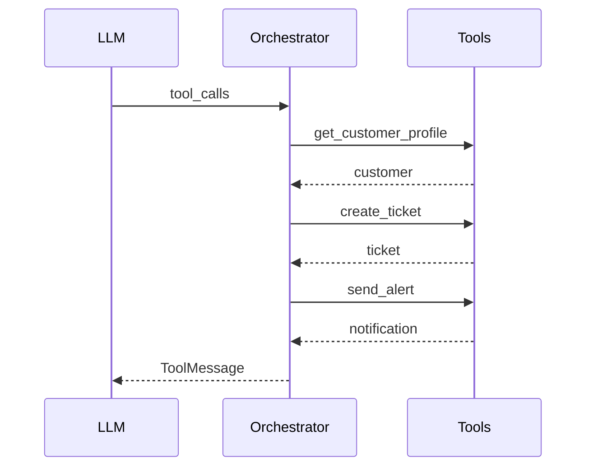

# SupportPilot AI

面向中小企业客服场景的 **AI Agent 客服运营平台**。

它不是一个简单的 Chatbot，而是一个具备工作流编排、知识库检索、风险判断、工具调用、执行追踪与评估体系的 LLM 应用原型。项目重点展示如何把 LLM 能力落到一个可运行、可观测、可评估、可迭代的业务闭环里。

## Product Preview



## Highlights

- **LangGraph StateGraph 工作流**：编排意图识别、风险判断、知识检索、回答生成、回答校验、动作决策与工具执行。
- **RAG 知识库检索增强**：支持 keyword / vector / dense / hybrid 检索策略，回答返回引用来源。
- **Function Calling 工具闭环**：通过 `bind_tools`、`tool_calls` 解析与 `ToolMessage` 回填完成客户查询、工单创建与通知。
- **安全优先混合决策**：高风险请求规则兜底，常规路径使用 LLM 提升泛化能力。
- **Trace + Token Usage 可观测**：记录工作流过程，并从 LLM response usage 读取真实 token 用量。
- **Eval + pytest**：7 类 20 条评估用例；89 个单元测试覆盖 API、工作流、RAG、工具调用与结构化输出兜底，本机完整环境 100% 通过。

## Demo Scenarios

| 场景 | 输入示例 | 预期表现 |
|---|---|---|
| 普通客服咨询 | 我的快递什么时候发货？ | RAG 命中物流知识并自动回复 |
| 退款/发票问题 | 七天无理由退货怎么申请？ | 基于知识库生成客服回复 |
| 商品破损 | 收到的杯子碎了，外包装也坏了 | Function Calling 创建工单并通知 |
| 投诉/赔偿 | 我要投诉并要求赔偿 | 高风险规则兜底，转人工处理 |
| 闲聊/无关问题 | 今天心情不好 | 进入自由对话或安全降级路径 |

## Demo Gallery

| 客服对话入口 | RAG 回复过程 |
|---|---|
|  |  |

## Architecture



## Agent Tool Loop



实现细节：

- 有真实 LLM 时走 `bind_tools` 多轮 function-calling loop。
- 每轮解析 `tool_calls`，执行对应客服工具，再用 `ToolMessage` 回填。
- 设置最大轮次，避免工具调用失控。
- LLM 工具路径失败时回退到确定性工具执行，保证 demo 和测试稳定。

## Evaluation

项目包含一套轻量 eval，用来验证规则路径、真实 LLM 路径和安全兜底策略的取舍。

| 指标 | 规则引擎 | 真实 LLM |
|---|---:|---:|
| 端到端准确率 | 75% | 受动作决策波动影响 |
| 意图准确率 | 75% | 90% |
| 安全升级率 | 100% | 100% |
| implicit 隐含意图 | 0% | 100% |
| ambiguous 模糊表达 | 0% | 100% |
| paraphrase 同义改写 | 0% | 50% |

结论：

- LLM 在改写表达、隐含意图和模糊表达上明显强于关键词规则。
- 高风险请求的安全升级率必须保持 100%，因此投诉、赔偿、提示注入等路径保留确定性规则兜底。
- 89 个单元测试覆盖 API、工作流、RAG 检索、风险判断、工具调用、结构化输出兜底等核心路径，本机完整环境 100% 通过；其中 2 个 dense 向量检索测试在缺少离线 embedding 模型的环境会通过 `importorskip` 自动跳过，此时为 `87 passed, 2 skipped`，业务逻辑测试不受影响。

更多说明见：

- [设计决策](docs/design_decisions.md)
- [评估报告](docs/eval_report.md)
- [演示脚本](docs/demo_script.md)

## Tech Stack

后端：

- Python / FastAPI
- Pydantic v2
- LangChain / LangGraph
- SSE streaming
- SQLite / JSON storage adapter
- Markdown RAG chunk loader
- fastembed + FAISS
- pytest

前端：

- React 19
- Vite 7
- Tailwind CSS
- three / @react-three/fiber / @react-three/drei

## Project Structure

```text
SupportPilot-AI-MVP/
├── backend/
│   ├── app/
│   │   ├── api/          # FastAPI routes
│   │   ├── workflow/     # AI 客服工作流与 LangGraph 编排
│   │   ├── rag/          # 检索器、query rewrite、chunk loader
│   │   ├── services/     # 业务服务
│   │   ├── storage/      # SQLite / JSON 存储适配
│   │   ├── templates/    # demo_ecommerce 模板配置
│   │   └── models/       # Pydantic schema
│   ├── data/
│   │   ├── kb/           # Markdown 知识库
│   │   └── mock/         # Demo mock 数据
│   ├── scripts/          # eval / retriever 对比脚本
│   └── tests/
├── frontend/
│   └── src/
│       ├── app/
│       ├── pages/
│       ├── features/workbench/
│       ├── services/
│       └── components/
└── docs/
```

## Quick Start

### 0. Prepare Environment

```powershell
cd SupportPilot-AI-MVP
python -m venv .venv
.\.venv\Scripts\python.exe -m pip install -r backend\requirements.txt
.\.venv\Scripts\Activate.ps1
```

### 1. Start Backend

```powershell
cd SupportPilot-AI-MVP\backend
python -m uvicorn app.main:app --host 127.0.0.1 --port 8000
```

Backend:

```text
http://127.0.0.1:8000
```

### 2. Start Frontend

```powershell
cd SupportPilot-AI-MVP\frontend
npm install
npm run dev -- --port 5173
```

Frontend:

```text
http://127.0.0.1:5173
```

### 3. Run Tests

```powershell
cd SupportPilot-AI-MVP\backend
python -m pytest -q
```

### 4. Run Eval

```powershell
cd SupportPilot-AI-MVP\backend
python scripts\run_eval.py
```

如果要对比真实 LLM：

```powershell
cd SupportPilot-AI-MVP\backend
$env:LLM_PROVIDER = "deepseek"
$env:DEEPSEEK_API_KEY = "<your-key>"
python scripts\run_eval_compare.py
```

## API Overview

核心接口：

```text
POST /api/chat
POST /api/chat/stream
POST /api/product-chat
GET  /api/metrics
GET  /api/traces
GET  /api/tickets
GET  /api/knowledge/documents
```

示例：

```json
{
  "customer_id": "shop_001",
  "message": "我的快递什么时候发货？",
  "history": []
}
```

## Environment Variables

| 变量 | 默认值 | 说明 |
|---|---|---|
| `LLM_PROVIDER` | `mock` | LLM 提供方。可选 `mock` / `deepseek` / `openai` / `qwen` |
| `DEEPSEEK_API_KEY` | 空 | DeepSeek API key |
| `LLM_WORKFLOW_ENGINE` | `procedural` | 工作流引擎。可选 `procedural` / `langgraph` |
| `RAG_RETRIEVER` | `hybrid` | 检索器。可选 `hybrid` / `keyword` / `vector` / `dense` |
| `RAG_TOP_K` | `5` | 检索返回片段数 |
| `RAG_QUERY_REWRITE` | `true` | 是否启用规则 query rewrite |
| `RAG_QUERY_REWRITE_LLM` | `false` | 是否启用 LLM query rewrite |
| `STORAGE_BACKEND` | `sqlite` | 存储后端。可选 `sqlite` / `json` |

## Roadmap

- 增加更多行业模板，例如 SaaS 客服、教育咨询、本地生活服务。
- 支持 PDF / DOCX / 网页 / 企业文档连接器。
- 将 intent set 从硬编码 enum 演进为模板可配置。
- 增加认证、权限、多租户和真实客服渠道接入。
- 增加工单 SLA、负责人分配规则和通知渠道配置。

